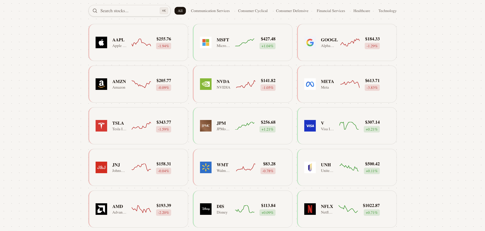

# TensorWave Stock Dashboard

A stock dashboard I built for the TensorWave coding challenge. You can browse 15 stocks on the homepage and click into any of them to see company info, a price chart, and a daily price table.



## Quick Start

You'll need Node.js 18+ and npm.

```bash
git clone https://github.com/scribblepear/tensorwave-stock-dashboard.git
cd tensorwave-stock-dashboard
npm install
```

Create a `.env.local` file:

```
ALPHA_VANTAGE_API_KEY=your_api_key_here
```

You can get a free key at [alphavantage.co/support](https://www.alphavantage.co/support/#api-key).

```bash
npm run dev
```

Then open [http://localhost:3000](http://localhost:3000).

## Tech Stack

- **Next.js 16** (App Router) for server components and routing
- **TypeScript** for type safety
- **Tailwind CSS v4** for styling
- **Recharts** for the price charts
- **AlphaVantage API** for company data and daily prices

## Requirements

- [x] 15 stocks displayed on the homepage as cards with logos, tickers, and sparklines
- [x] Clicking a stock takes you to its detail page
- [x] Detail page loads Company Overview from AlphaVantage
- [x] Detail page loads TIME_SERIES_DAILY from AlphaVantage
- [x] Shows symbol, asset type, name, description, exchange, sector, industry, market cap (or "N/A")
- [x] Historical prices shown with date, close price, volume, and % change
- [x] Responsive / mobile-friendly
- [x] Company logos on both pages
- [x] Loading skeleton while data loads
- [x] Price chart with 1W / 1M / 3M / 6M range toggles

## How It Works

API calls only happen on the detail page, not the homepage. The homepage reads from local data files so it loads instantly and doesn't use up any API calls.

For the detail page, I set up caching so the app doesn't hit the API more than it needs to. Company overviews barely change (only on earnings reports), so those are cached for 30 days. Daily prices are cached for 24 hours since they only update once a day after market close.

If the API is down or rate-limited, the app just shows the last cached data instead of breaking.

I also added a feature where you can click a row in the price table and it highlights that date on the chart, automatically switching to the right time range. Hovering over the chart clears the selection.

## Dealing with the 25/day API Limit

The free tier only gives you 25 API calls per day, so I had to be careful:

- All 15 company overviews are pre-fetched and included with the app, so they don't cost any API calls during normal use
- That means only daily price fetches count against the limit (1 per stock = 15/day)
- If something goes wrong, the app falls back to cached data instead of showing an error

## What I'd Improve

- The free tier only gives you end-of-day prices and 100 data points (~5 months). A premium key would unlock real-time quotes and full history.
- On Vercel the filesystem is read-only, so the file cache doesn't persist between serverless function calls. In production I'd use something like Redis instead.
- It's pretty easy to add more stocks since you only need to pre-seed overviews once (1 call each, cached for 30 days). After the daily limit resets you'd have room for the price calls too, so scaling to 20+ stocks would just take a couple days.
- With more time: tests, more financial data from the overview endpoint (P/E ratio, dividends, analyst ratings), and search by company name.

## Time Spent

~12 hours over 3 days.
